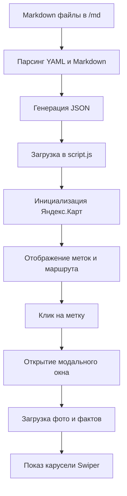

# Архитектура интерактивной карты Санкт-Петербурга

## Цель
Создать полноэкранную интерактивную карту для презентации маршрута по трём архитектурным объектам Санкт-Петербурга с функциями:
- Карта на весь экран (fullscreen)
- Точки локаций с названиями
- Маршрут, соединяющий точки в последовательности
- Модальное окно при клике на точку с фотографией и каруселью интересных фактов
- Данные хранятся в markdown файлах в папке `/md`

## Выбор технологий

### Картографическая библиотека
**Яндекс.Карты** (выбор пользователя)
- Преимущества: детализация Санкт-Петербурга, поддержка русского языка, удобный API для маркеров и полилиний.
- Требуется API-ключ (можно получить бесплатно на developer.tech.yandex.ru).
- Альтернатива: Leaflet с OpenStreetMap, но для презентации лучше использовать Яндекс.Карты.

### Фронтенд
- **HTML5/CSS3** для структуры и стилей.
- **Vanilla JavaScript** (без фреймворков) для простоты и скорости загрузки.
- **Swiper.js** (легковесная библиотека) для карусели фактов внутри модального окна.

### Хранение данных
- **Markdown файлы** в папке `/md`, по одному файлу на локацию.
- Структура файла: YAML front matter для метаданных (координаты, название, фото) + Markdown контент для фактов.
- **JSON индекс** генерируется из markdown для быстрой загрузки в JavaScript.

### Стилизация
- CSS Grid/Flexbox для адаптивности (хотя адаптив не обязателен, но базовый обеспечить).
- Кастомные стили для карты, маркеров, модального окна.

## Структура проекта

```
History_Map/
├── index.html              # Главная страница
├── style.css               # Основные стили
├── script.js               # Логика карты и взаимодействия
├── architecture_plan.md    # Этот файл
├── md/                     # Папка с данными локаций
│   ├── academy_arts.md     # Здание Академии художеств
│   ├── academy_sciences.md # Здание Академии наук
│   └── vasilievsky_spit.md # Ансамбль стрелки Васильевского острова
├── images/                 # Локальные фотографии (если используются)
│   ├── academy_arts.jpg
│   ├── academy_sciences.jpg
│   └── vasilievsky_spit.jpg
└── lib/                    # Внешние библиотеки (опционально)
    ├── swiper-bundle.min.css
    └── swiper-bundle.min.js
```

## Формат markdown файла локации

Пример `md/academy_arts.md`:

```yaml
---
id: 1
title: "Здание Академии художеств"
coordinates: [59.9386, 30.2901]
image: "images/academy_arts.jpg"
order: 1
---

### Описание
Первое здание маршрута — здание Академии художеств на Университетской набережной.

### Факты
- Основана в 1757 году.
- Строительство с 1764 по 1788 год.
- Архитекторы: Жан-Батист Валлен-Деламот и Александр Кокоринов.
- Яркий памятник раннего классицизма.
```

Поля front matter:
- `id` — уникальный идентификатор.
- `title` — название точки.
- `coordinates` — массив [широта, долгота] для Яндекс.Карт.
- `image` — путь к фотографии.
- `order` — порядок в маршруте.

Факты могут быть перечислены в markdown списках; для карусели каждый факт будет отдельным слайдом.

## Пример кода базовой карты

```html
<!DOCTYPE html>
<html lang="ru">
<head>
    <meta charset="UTF-8">
    <title>Историческая карта Санкт-Петербурга</title>
    <link rel="stylesheet" href="style.css">
    <script src="https://api-maps.yandex.ru/2.1/?apikey=ваш_ключ&lang=ru_RU"></script>
    <link rel="stylesheet" href="https://unpkg.com/swiper/swiper-bundle.min.css">
</head>
<body>
    <div id="map" style="width: 100vw; height: 100vh;"></div>
    <div id="modal" class="modal hidden">
        <div class="modal-content">
            <span class="close">&times;</span>
            
            <div class="swiper">
                <div class="swiper-wrapper">
                    <!-- факты будут вставлены динамически -->
                </div>
                <div class="swiper-pagination"></div>
            </div>
        </div>
    </div>
    <script src="https://unpkg.com/swiper/swiper-bundle.min.js"></script>
    <script src="script.js"></script>
</body>
</html>
```

## План пошаговой реализации

1. **Создание markdown формата для данных**
   - Определить структуру YAML front matter.
   - Создать три файла в `/md` на основе данных из `route_presentation.md`.

2. **Разработка базовой HTML/CSS/JS структуры**
   - `index.html` с контейнером карты и модальным окном.
   - `style.css` для fullscreen карты и скрытого модального окна.
   - `script.js` с заглушками.

3. **Интеграция Яндекс.Карт**
   - Получить API-ключ (пользователь должен вставить свой).
   - Инициализировать карту с центром на Санкт-Петербурге.
   - Настроить zoom и controls.

4. **Реализация точек и маршрута**
   - Загрузить данные из markdown (через fetch или сгенерированный JSON).
   - Добавить метки (Placemark) на карту.
   - Построить полилинию между точками в порядке `order`.

5. **Реализация модального окна с каруселью**
   - При клике на метку открывать модальное окно.
   - Загружать соответствующее изображение и факты.
   - Инициализировать Swiper для карусели.

6. **Тестирование и финальная настройка**
   - Проверить работу в браузере.
   - Убедиться, что карта занимает весь экран.
   - Оптимизировать загрузку изображений.

## Диаграмма потока данных



## Следующие шаги

После утверждения этого плана можно переключиться в режим **Code** для реализации.
